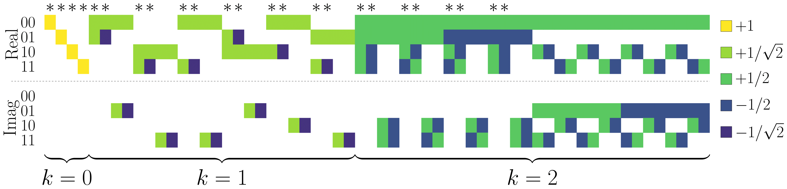

# stabilizer extent



This repository provides source code for **Stabilizer Extent** calculation, **Stabilizer Fidelity** calculation, and **generating all the pure Stabilizer States** in computational basis.

This is also the supplemental material for our paper,
**"Faster Computation of Stabilizer Extent"**(2024).

https://arxiv.org/abs/2406.16673

## How to run the code

We require three setups to run the code.

### 1. Install the required python libraries

It is recommended that you prepare a new virtual Python environment and run
`pip install -r requirement.txt`
to ensure that libraries are compatible.

Or, if you could not build the virtual environment successfully,
you can use the following command to install the required libraries:

```bash
pip install -e .
pip install tqdm
pip install scipy
pip install numpy
pip install numba
pip install mosek
pip install qutip
pip install cvxopt
pip install qiskit
pip install seaborn
pip install matplotlib
pip install openfermion
```

### 2. (optional) Install MOSEK

Although you can partially run the tutorial.ipynb without this step, but we highly recommended to install MOSEK to accelerate the computation.

We use MOSEK to solve SOCP.
You can download the MOSEK software from the [MOSEK website](https://www.mosek.com/).
Please get a license file according to the instructions on the website.

### 3. (optional) Compile C++ code

Although you can partially run the tutorial.ipynb without this step, but we highly recommended to compile the C++ code to accelerate the computation.
The only file you have to compile is `exputils/cpp/calc_dot.cpp`.

You can compile the C++ code by running the following command:

```bash
pwd # check the current directory is path to stabilizer_extent
g++ exputils/cpp/calc_dot.cpp -o exputils/cpp/calc_dot.exe -std=c++17 -O2 -mtune=native -march=native -fopenmp -lz
```

The meaning of each option is as follows:

| option | meaning |
|:---|:---|
| -o | output file name |
| -std=c++17 | use C++17 |
| -lz | use zlib (to use npz files in C++)|
| -O2 | optimization level 2 (-O3 might be worse than -O2) |
| -DNDEBUG | disable assertions (if you want to debug, remove this option) |
| -mtune=native | optimize for the machine you are using |
| -march=native | optimize for the machine you are using |
| -fopenmp | use OpenMP (for parallelization) |

## Tutorial

The tutorial notebook is available at [tutorial.ipynb](tutorial.ipynb).

## Citation

If you use this code, please cite our paper:

```
@misc{hamaguchi2024fastercomputationstabilizerextent,
      title={Faster Computation of Stabilizer Extent}, 
      author={Hiroki Hamaguchi and Kou Hamada and Naoki Marumo and Nobuyuki Yoshioka},
      year={2024},
      eprint={2406.16673},
      archivePrefix={arXiv},
      primaryClass={quant-ph}
      url={https://arxiv.org/abs/2406.16673}, 
}
```

## License

Copyright (c) 2024 Nobuyuki Yoshioka

This project is licensed under the MIT License - see the [LICENSE](LICENSE) file for details.

## Contact

If you have trouble, please feel free to contact us.
